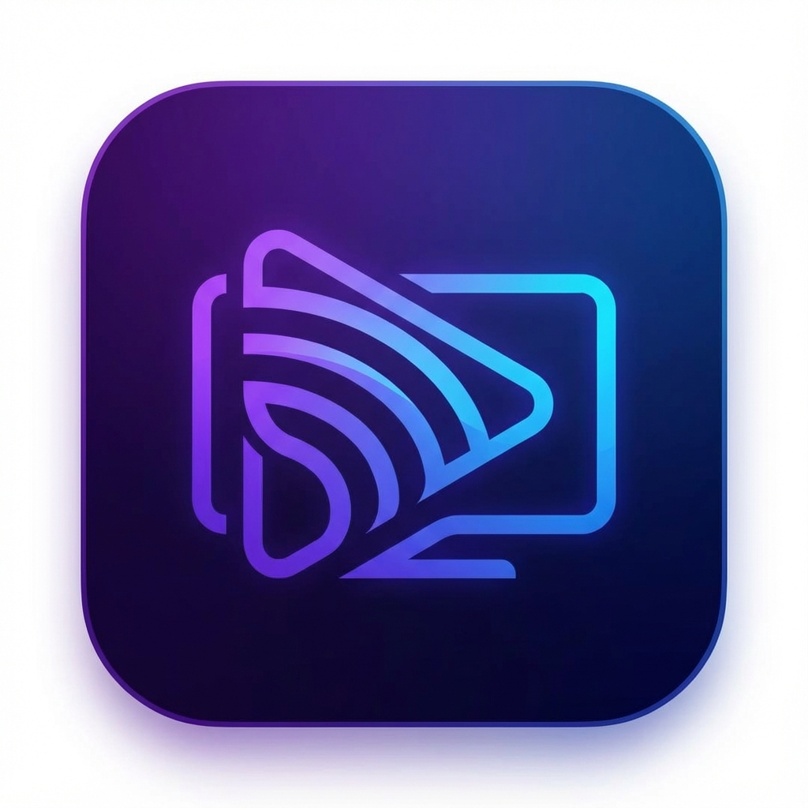

# IPTV Player

A modern, fast, and feature-rich IPTV Player built with Python and Flet. It supports local playlists, Xtream Codes API, and casting to DLNA devices (Smart TVs).



## Features

*   **Modern UI**: Beautiful dark interface with responsive design.
*   **Xtream Codes Support**: Connect to your provider with username/password.
*   **M3U Playlist Support**: Load local or remote `.m3u` playlists.
*   **Smart Casting**: Cast any stream to your DLNA-enabled TV.
    *   **Gapless Playback**: "Next" button on TV remote works!
    *   **Sync Playback**: Watch on PC and TV simultaneously.
*   **Favorites Manager**: Save your best channels.
*   **Search**: Fast channel searching.

## How It Works

The application uses a smart proxy system to make modern IPTV streams compatible with older and newer Smart TVs.

```mermaid
graph TD
    User[User] -->|Interacts| App[IPTV Player App]
    App -->|Plays on PC| MPV[Internal Video Player]
    
    subgraph "Casting System"
        App -->|1. Discovers| TV[Smart TV (DLNA)]
        App -->|2. Starts| Proxy[Stream Proxy Server]
        Proxy -->|3. Converts/Proxies| Stream[Live Stream]
        TV -->|4. Requests Stream| Proxy
    end
    
    App -->|5. Controls (Play/Pause/Next)| TV
```

## Installation

### Linux (Debian/Ubuntu)

Download the `.deb` file and install:

```bash
sudo dpkg -i iptv-player.deb
```

### Windows

1.  Download the project.
2.  Install Python 3.12+.
3.  Install dependencies: `pip install -r requirements.txt`
4.  Run: `flet run main.py` or build the .exe using `flet pack main.py`.

### Other Linux (AppImage)

Run the AppImage directly:
```bash
chmod +x iptv-player.AppImage
./iptv-player.AppImage
```

You can build it using `scripts/build_appimage.sh` (requires `ipvt-player` binary from `.deb` build).

### Android

To build for Android:
1.  Install Flutter SDK and Android SDK.
2.  Run: `scripts/build_android.sh` or `flet build apk`.

## Casting Guide

1.  Open a channel.
2.  Click the **Cast Icon** (WiFi symbol).
3.  Wait for your TV to appear in the list (must be on same WiFi).
4.  Click your TV name.
5.  **Controls**:
    *   Use the App overlay to Pause/Stop/Change Volume.
    *   Use your **TV Remote** to skip to the next channel!

## Creator

**Abdelhalim Serhani**

*   **GitHub**: [serhabdel](https://github.com/serhabdel)
*   **LinkedIn**: [Abdelhalim Serhani](https://www.linkedin.com/in/abdelhalim-serhani-b427941b2/)

## License

This project is licensed under the MIT License - see the [LICENSE](LICENSE) file for details.

Copyright (c) 2025 Abdelhalim Serhani
